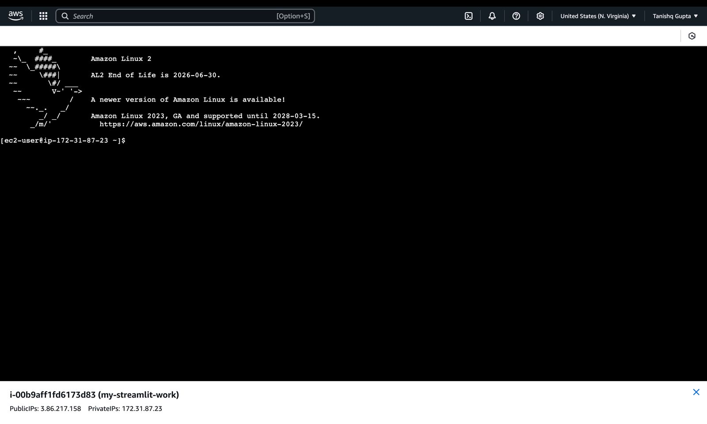
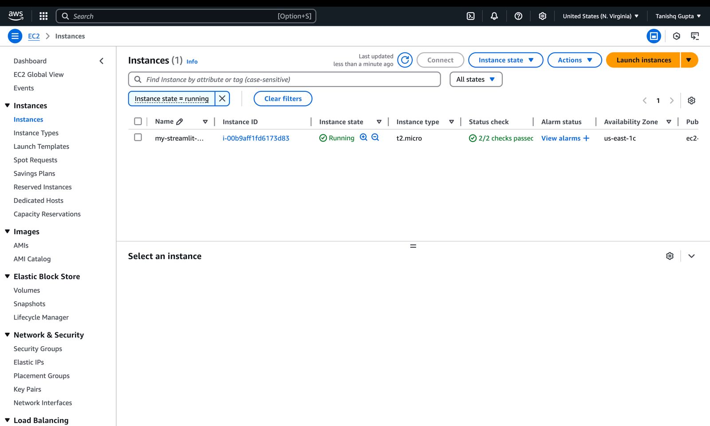
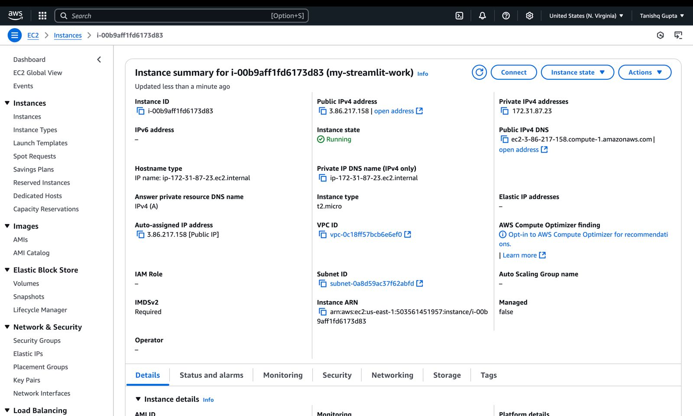
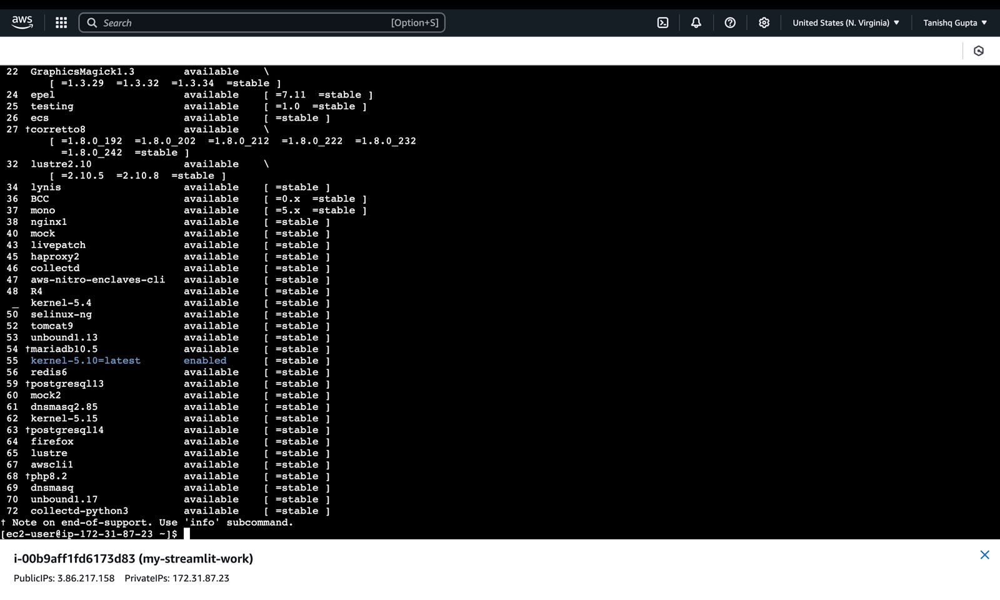
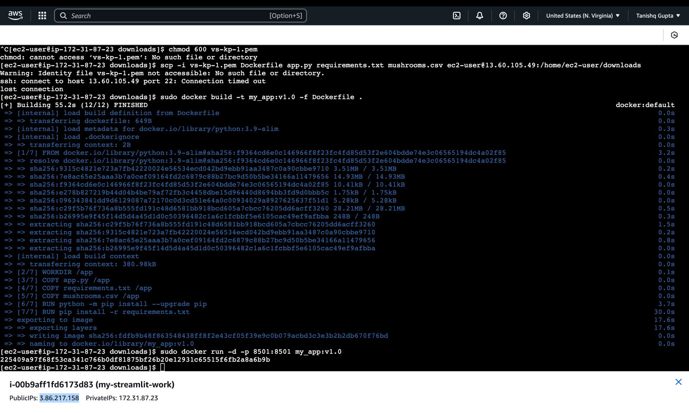

# ML Model Using Docker

We are going to create the ML model using the Docker and we will train the model to do so.


## Documentation

[Docker](https://docs.docker.com/)

[ML model using Docker](https://www.geeksforgeeks.org/how-to-use-docker-for-machine-learning/)

[Machine Learnings](https://www.geeksforgeeks.org/machine-learning-models/)


## Installation of ML model and Docker

First of all we will check for Docker and python is installed in the system or not.

For Docker: 
```bash
docker --version
```

For Python:
```bash
python --version
```

Now after that we will import the ML model(already in github):
```bash
 app.py 
```

Create a requirements.txt File.
```bash
pip freeze requirements.txt
```

The Dockerfile is a script that contains a series of instructions used to build a Docker image.
Following is the simple dockerfile for our app. Make sure that the dockerfile is created with no extension, as it allows Docker to recognize it without requiring any additional arguments when building an image:

Now we will import the Docker file also.
```bash
# For more information, please refer to https://aka.ms/vscode-docker-python
FROM python:3.9-slim


WORKDIR /app
COPY app.py /app
COPY requirements.txt /app
COPY mushrooms.csv /app
RUN python -m pip install --upgrade pip
RUN pip install -r requirements.txt
EXPOSE 8501
# Creates a non-root user with an explicit UID and adds permission to access the /app folder


# During debugging, this entry point will be overridden. For more information, please refer to https://aka.ms/vscode-docker-python-debug
ENTRYPOINT ["streamlit", "run", "app.py", "--server.port=8501", "--server.address=0.0.0.0"]
```

1. FROM: It specifies the base image for our Dockerfile. We are using Python 3.11-slim in our case.

2. WORKDIR: It sets the working directory to the given path. After this, all commands will be executed relative to this directory.
3. COPY: This command copies the contents from your local machine to the Docker container. Here, it’s copying requirements.txt and model.py files.

4. RUN: It executes the command inside a shell (within the image's environment). Here, it is installing all the project dependencies listed in the requirements.txt file.

5. CMD: This command specifies the default command to run when the container starts. It is running a model.py script using Python in this case.

After that we will also import the CSV file which we need to train (Already on Github Repo)

```bash
mushrooms.csv
```


## Deployment

Now we will deploy using the Docker

Open your command prompt or terminal, navigate to the working directory where your Dockerfile is located, and run the following command.

1. Now we will build the docker app using the below command:

```bash
docker build -t app.py .
```
 This command builds a docker image named app.py using the current directory.

2. Now we will check that the image is created or not.

```bash
docker images
```
3. Run the Docker Container

```bash
docker run app.py
```

4. Tag & Push the Container to DockerHub

Docker Hub is a repository for Docker images, making it easy to share, version, and distribute containers across teams or production environments.

Create an account on Docker Hub. Once you have it, log in through the terminal by running the following command.

```bash
docker login
```

5. You have to tag the docker image with your username so that it will know where to push the image. Run the following command by replacing your username.

```bash
docker tag app.py yourdockerhubusername/app.py
```

6. Once the image has been tagged, you can push the image to the Docker hub by the following command.

```bash
docker push yourdockerhubusername/ml-model
```

Your ML model using Docker is ready.


## 📖 Overview

Welcome to **My App**! This project is a Dockerized application that serves a web interface for [brief description of your app, e.g., "an interactive data visualization tool for analyzing mushroom species"]. It is built using **Python** and **Streamlit**, providing an engaging and user-friendly experience for users to explore and interact with data.

### 🌟 Features

- **Interactive UI**: Users can easily navigate through the application and visualize data.
- **Data Analysis**: Perform various analyses on the provided datasets.
- **Responsive Design**: The application is designed to work seamlessly on different devices.



## 🛠️ Prerequisites

Before you begin, ensure you have met the following requirements:

- An **Amazon Linux 2** instance running on AWS EC2.
- **Docker** installed on your instance.
- Access to your AWS EC2 instance via SSH.
- Basic knowledge of using the command line.






### 📋 Required Software

- **Docker**: A platform for developing, shipping, and running applications in containers.
- **SSH Client**: To connect to your EC2 instance.




## 📦 Setup Instructions

Follow these steps to set up and run the application:

### 1. Update the System and Install Docker

First, update your system packages to ensure you have the latest versions:

```bash
sudo yum update -y

 




